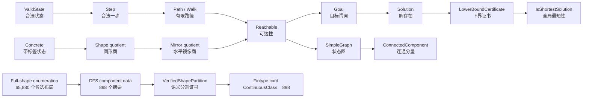

# 当前 Lean 形式化成果总览

## 1. 项目定位

正式名称：

> 基于 Lean 4 的华容道有限状态空间与离散几何形式化研究

核心研究问题：

> 华容道的合法滑动、可达性、对称商、最短解和关键门区，能否在 Lean 4 中以可检查的定义、定理和有限证书严格表达？

当前项目把华容道作为一个有限状态转移系统研究。证明对象是合法状态、合法一步、有限路径、可达性、商空间和有限图证书；前端图形只负责展示这些对象。

## 2. 总体证明链



准确的主证明依赖关系是：

```text
合法状态
  -> 合法移动
  -> 路径 / Walk
  -> Reachable
  -> 目标与 Solution
  -> 有限图或势函数下界
  -> 最短性
```

其中 `898` 分支是全空间计算的另一条证明线：有限枚举 -> DFS 数据 -> 语义分割 -> 连续等价类基数。

## 3. 状态空间层次

| 层次 | Lean 类型 | 含义 | 当前状态 |
|---|---|---|---|
| 具体层 | `ValidClassicState` | 带合法性证明的编号棋盘 | 已完成 |
| 同形层 | `ShapeState` | 忘记四个竖块和四个小兵的编号 | 已完成 |
| 镜像层 | `MirrorShapeState` | 进一步按水平镜像识别 | 已完成 |
| 连续分量层 | `ContinuousClass` | 同形层按单格合法滑动的可达等价类 | 定义和一般理论已完成 |

具体层和同形层之间是精确商，而不是只保留一个方向的近似映射。`SameShapeStepLift`、重标号等变性、路径长度保持和路径提升共同保证了同形商的可达性和最短长度结论。

## 4. 已完成的 Lean 定义和定理

### 4.1 基础模型

- `Piece`、`Shape`、`Pos`、`State`、`Direction`
- `occupiedCells`、`inBounds`、`noOverlap`、`valid`
- `ValidState`
- `tryMove`、`Step`、`Reachable`
- `Path`、`Solution`、`CertifiedPlay`

### 4.2 合法性与可达性

- `classic_valid`：经典初态合法
- `tryMove_preserves_validity`：成功移动保持合法性
- `step_preserves_validity`
- `reachable_preserves_validity`
- `tryMove_reverse_of_valid`
- `concreteReversible`、`shapeReversible`、`mirrorReversible`
- `Task.reachable_refl`
- `Task.reachable_trans`
- `Task.Reversible.reachable_symm`
- `Task.Reversible.reachable_le_equivalence`

因此，在可逆任务上，`Reachable` 是合法一步生成的最小等价关系。

### 4.3 图论接口

- `Task.simpleGraph`
- `Task.Reversible.task_reachable_iff_simpleGraph`
- `Task.Reversible.componentEquivConnectedComponent`
- `same_component_iff_mathlib`
- 状态图、有限诱导子图、BFS 距离和 `SimpleGraph.dist` 的桥接

### 4.4 商空间与对称

- `SameShape`
- `sameShapeStepLift`
- `concreteToShape`、`shapeToMirror`、`concreteToMirror`
- `StateSpace.SymmetryAction`
- 同形标签换位和水平镜像作用
- 定长路径、定长解、最短解长度在 `concrete -> shape -> mirror` 两层商之间保持

### 4.5 经典 116 步结果

- 经典 116 步动作列表的内核检查
- `classic116Play_minimal`
- `ClassicStateSpaceKernel.concreteSolution_lower_bound`
- 经典同形商上的 116 步全局最短性
- 曹操位置投影、曹操目标位置商和镜像位置观测

### 4.6 局部离散几何与门区

- `ActionsCommuteAt`、`SquareAt`
- 交换动作给出的方形和四步闭合路径
- 二分图与步长奇偶性
- 边割、顶点割、桥和门区证书
- “所有成功路径必须进入指定门区”的抽象定理
- `FundamentalLoopClass` 的方形/回退基本群预备接口

## 5. 全形状空间的当前结果

构造枚举固定曹操、关羽、四个竖块和四个小兵的几何位置，得到：

```text
骨架数                         4,392
每个骨架的小兵选择数           C(6,4) = 15
同形候选布局数                 65,880
DFS 分量数                     898
经典初态所在分量大小           25,955
最大分量                       25,955（共两个）
水平镜像下分量轨道数           459
水平镜像固定分量数             20
```

这些数值由 `ClassicFullSpace` 的可执行定义和隔离的
`ClassicFullSpaceCertificate` 原生证书得到。它们目前应被表述为：

1. Lean 可执行程序计算出的结果；
2. `native_decide` 检查过的布尔事实；
3. 尚未全部提升为 `ContinuousClass` 基数定理的有限数据。

## 6. 证据层级

项目中必须区分四类结果：

| 层级 | 典型内容 | 是否是 Lean 内核定理 |
|---|---|---|
| Lean 内核定理 | `Reachable` 可逆、商路径长度保持、`classic116Play_minimal` | 是 |
| Lean 可执行证书 | `native_decide` 检查状态数、闭包、分量摘要、有限图下界 | 是布尔检查的证明见证；语义含义需有 soundness 定理 |
| 外部脚本计算 | Python/JavaScript 复算、布局分析、桥候选筛选 | 否 |
| 前端可视化 | Three.js、力导向坐标、局部样本、动画 | 否 |

外部脚本和前端可以帮助发现结构，但不能单独证明合法性、可达性、最短性或分量数。

## 7. 898 个连续等价类的证明接口

`Huarongdao/ClassicFullSpaceSoundness.lean` 现在包含以下语义桥：

```lean
structure VerifiedShapePartition where
  StateIndex : Type
  ComponentIndex : Type
  state : StateIndex → ShapeState
  classOf : StateIndex → ComponentIndex
  rank : StateIndex → Nat
  root : ComponentIndex → StateIndex
  root_component : ...
  complete : ...
  state_eq_component : ...
  root_or_parent : ...
  closed : ...
```

其中：

- `complete` 保证每个数学上的 `ShapeState` 都出现在有限索引中；
- `root_or_parent` 和严格递减的 `rank` 给出每个索引到根的路径；
- `closed` 保证每个合法一步的终点仍被索引且标签不变；
- `root_component` 保证根索引确实携带对应分量标签；
- `state_eq_component` 处理空路径和重复表示。

已完成的通用定理包括：

```lean
VerifiedShapePartition.root_reachable
VerifiedShapePartition.reachable_of_component_eq
VerifiedShapePartition.component_eq_of_reachable
VerifiedShapePartition.component_eq_iff_reachable
VerifiedShapePartition.rootClass_surjective
VerifiedShapePartition.rootClass_injective
VerifiedShapePartition.componentEquivContinuousClass
VerifiedShapePartition.fintypeCard_continuousClass_eq
ComponentRun.Lawful.component_eq_iff_reachable
ComponentRun.Lawful.continuousClass_card_eq_898_of_certificate
```

最后一个定理的精确含义是：给定一个满足 `ComponentRun.Lawful` 的有限 DFS 分割，并给出其分量类型的基数为 `898`，就能严格推出：

```lean
@Fintype.card ContinuousClass
  (VerifiedShapePartition.continuousClassFintype certificate) = 898
```

这已经闭合了“有限分割证书 -> 连续等价类基数”的数学桥，但 `certificate` 仍需由经典全空间计算证书实例化。

## 8. 当前未完成事项

### 必须完成才能得到无条件的 `898`

1. **生成器完备性**

   已在 `Huarongdao/ClassicFullSpaceCompleteness.lean` 证明：

   ```lean
   EnumerationComplete
   ```

   即任意 `ValidClassicState` 都与 `allShapeStatesList` 中某个规范代表 `SameShape`。同时已证明其到数组索引覆盖的桥 `enumerationComplete_quotient_cover`。

2. **规范代表唯一性**

   证明同形相等的两个生成代表具有相同的有限状态索引。当前的 `uniqueKeys` 是哈希集合上的可执行去重检查，仍需要独立的键 soundness 或直接的 canonical representative 唯一性定理。

   当前接口已将这一缺口显式化：

   ```lean
   fullSpace_semanticCertificate_of_injective
   fullSpaceRun_lawful_of_checked
   ```

   前者把代表元索引单射与完备性组装为语义证书，后者再接收
   `checkFinite allShapeStates fullSpaceRun = true` 生成 `ComponentRun.Lawful`。
   因此后续只需分别提供“索引单射”和“有限 checker 成功”两个证书。

3. **DFS 索引级证书**

   需要把以下事实作为 `ComponentRun.Lawful` 的输入，而不是只作为汇总布尔值：

   - 每个数组元素合法；
   - 每个分量标签在范围内；
   - 每个根索引在范围内；
   - 根标签等于分量编号；
   - 每个非根节点有严格降秩的合法父边；
   - 所有合法后继都回到同一标签；
   - 所有形状状态都被覆盖（生成器完备性已单独证明）；
   - 同一 `ShapeState` 的规范代表不会占用两个索引。

### 已有 checker 的 soundness 接口

`ClassicFullSpaceSoundness.lean` 已给出：

```lean
checkParentEdge_sound
checkParents_sound
checkLabelClosedAt_sound
checkLabelClosed_sound
ComponentRun.Lawful.checkLabelsBounded_sound
ComponentRun.Lawful.checkRootsBounded_sound
ComponentRun.Lawful.checkRootLabels_sound
```

`enumerationComplete_quotient_cover` 现在位于 `ClassicFullSpace.lean`。这些定理把布尔检查结果转换成证明命题；它们不替代 canonical representative 唯一性证明和 `ComponentRun.Lawful` 的最终聚合。

## 9. 展示时可直接使用的最小定理链

### 经典 116 步

```lean
classic_valid
  -> classic116Play_checked
  -> classic116Play_solution
  -> classic116Play_minimal
```

### 可逆性与连通分量

```lean
concreteReversible
  -> Task.Reversible.reachable_symm
  -> concrete_component_eq_iff_reachable
  -> same_component_iff_mathlib
```

### 同形商与镜像商

```lean
sameShapeStepLift
  -> concreteToShape
  -> shapeToMirror
  -> 定长路径保持
  -> 最短解长度保持
```

### 全空间 898 目标

```lean
EnumerationComplete                         [已证明]
  + canonical representative uniqueness      [待完成]
  + ComponentRun.Lawful                      [待由证书聚合]
  + componentCount = 898                     [已由 native_decide 证明]
  -> continuousClass_card_eq_898_of_certificate
```

## 10. 相关文件

- [`Huarongdao/ClassicFullSpace.lean`](../Huarongdao/ClassicFullSpace.lean)：全形状空间枚举和 DFS 数据结构
- [`Huarongdao/ClassicFullSpaceSoundness.lean`](../Huarongdao/ClassicFullSpaceSoundness.lean)：DFS 语义 soundness 和基数桥
- [`Huarongdao/ClassicFullSpaceCompleteness.lean`](../Huarongdao/ClassicFullSpaceCompleteness.lean)：规范枚举的结构性完备性证明
- [`Huarongdao/ClassicFullSpaceCertificate.lean`](../Huarongdao/ClassicFullSpaceCertificate.lean)：65,880、898 等隔离原生证书
- [`Huarongdao/ClassicContinuousClassCard.lean`](../Huarongdao/ClassicContinuousClassCard.lean)：隔离的连续分量基数和经典大分量计数接口
- [`Huarongdao/StateSpaceConnectivity.lean`](../Huarongdao/StateSpaceConnectivity.lean)：可逆可达性、连通分量和 Mathlib 图论桥
- [`Huarongdao/CaoProjection.lean`](../Huarongdao/CaoProjection.lean)：曹操位置观测和位置商
- [`docs/FULL_SHAPE_SPACE.md`](FULL_SHAPE_SPACE.md)：全形状空间计算记录和剩余证明缺口
- [`docs/REACHABILITY_AND_CONTINUITY.md`](REACHABILITY_AND_CONTINUITY.md)：可达性、组合连续性和商空间说明
